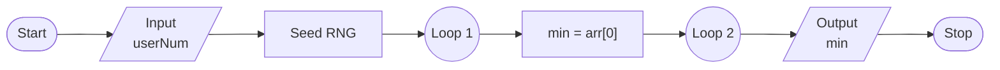
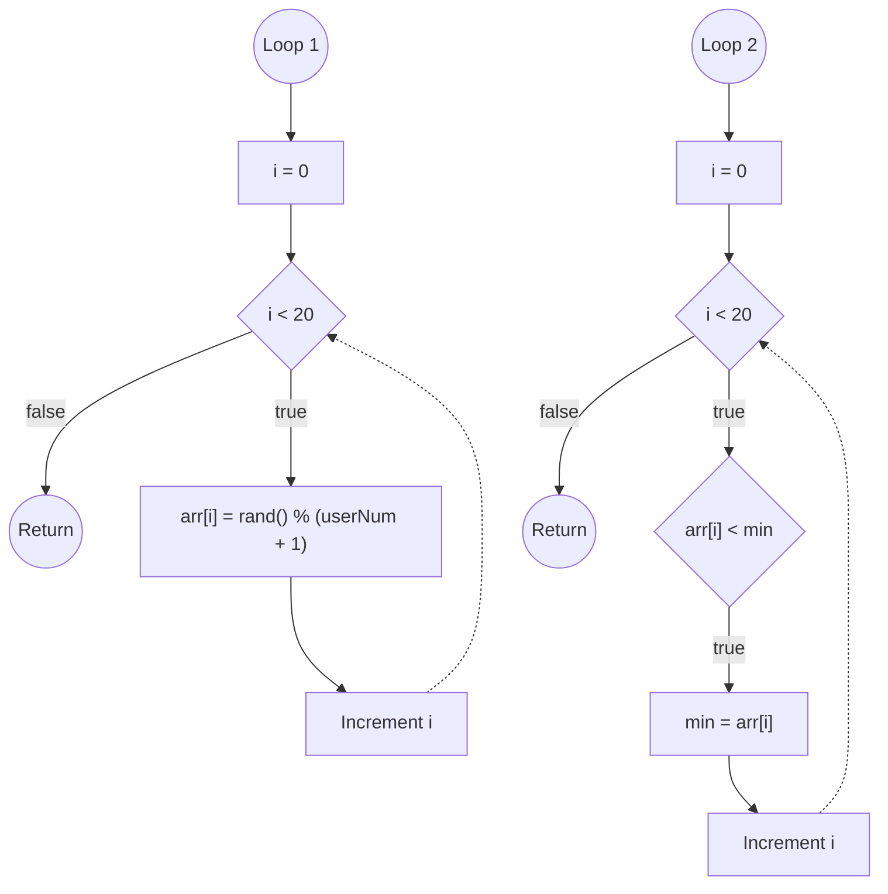

# Exercise 1: Smallest Number in Array
### Description
Write a program that finds the smallest element in a one-dimensional array containing 20 random integer values in the range 0 to N, where N is a value entered at runtime by the user.
<br/><br/>
### Pseudocode
- Prompt user for value of N, save as `userNum`.
- Seed random number generator.
- Fill each element of array with random number between 0 and `userNum`.
- Assign first value in array to `min`.
- Loop through array and find smallest number, save as `min`.
- Output value of `min`.
<br/><br/>
### Flowchart


<br/><br/>
### Output
```
C:\****\Week-3\Exercise 1>a

Enter a number: 69420

Smallest: 448

C:\****\Week-3\Exercise 1>a

Enter a number: 69420

Smallest: 242

C:\****\Week-3\Exercise 1>a

Enter a number: 42  

Smallest: 0

C:\****\Week-3\Exercise 1>a

Enter a number: 42

Smallest: 4
```
