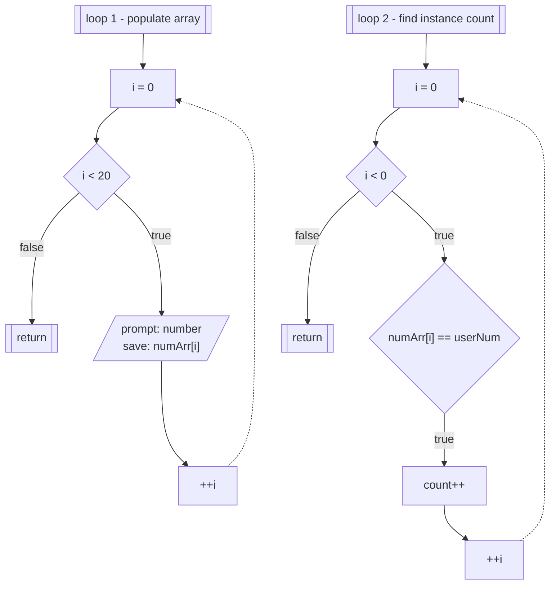

# Exercise 2: Finding the Instances of a Number in an Array
### Description
Write a program that allows a user to populate an array with 20 integer numbers. The program then asks the user to enter a number (at random) and searches how many instances of that number is found in the array and displays it on screen
<br/><br/>
### Pseudocode
- initialize `count` to 0
- prompt user for twenty numbers, store in `numArr`
- prompt user for number to search for in `numArr`
  - loop through `numArr`
  - if `userNum` equals `numArr[i]`, increment `count`
- output the number of times `userNum` was found in `numArr`
<br/><br/>
### Flowchart

<br/><br/>
### Output
```
C:\****\Week-3\Exercise 2>a

Enter 20 numbers
First number: 987
Second number: 654
Third number: 321
Fourth number: 123
Fifth number: 456
Sixth number: 789
Seventh number: 741
Eighth number: 852
Ninth number: 963
Tenth number: 159
Eleventh number: 263
Twelfth number: 487
Thirteenth number: 745
Fourteenth number: 956
Fifteenth number: 321
Sixteenth number: 542
Seventeenth number: 685
Eighteenth number: 326
Nineteenth number: 951
Twentieth number: 625


Enter a number to search: 354

The number 354 appears 0 times in the array

C:\****\Week-3\Exercise 2>a

Enter 20 numbers
First number: 51
Second number: 32
Third number: 95
Fourth number: 62
Fifth number: 84
Sixth number: 75
Seventh number: 41
Eighth number: 84
Ninth number: 32
Tenth number: 95
Eleventh number: 68
Twelfth number: 92
Thirteenth number: 38
Fourteenth number: 15
Fifteenth number: 16
Sixteenth number: 28
Seventeenth number: 46
Eighteenth number: 49
Nineteenth number: 34
Twentieth number: 17


Enter a number to search: 32

The number 32 appears 2 times in the array
```
